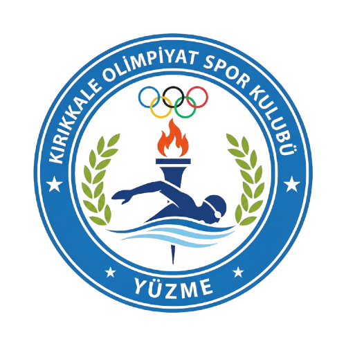

# 🏊 Kırıkkale Olimpiyat Spor Kulübü - Yüzme Branşı Yönetim Sistemi



Kırıkkale Olimpiyat Spor Kulübü Yüzme Branşı için geliştirilmiş profesyonel, kurumsal yönetim sistemi.

## ✨ Özellikler

### 👤 Admin Paneli
- Güvenli giriş sistemi (JWT tabanlı)
- Rol bazlı yetkilendirme (Super Admin, Admin, Moderatör)
- Modern ve minimal dashboard

### 🏃 Sporcu Yönetimi
- Sporcu kayıt ve takip sistemi
- Detaylı sporcu profilleri
- Yaş grubu ve seviye yönetimi
- Seans atamaları

### 📅 Seans Yönetimi
- Yüzme seansları oluşturma
- Kapasite ve dönem yönetimi
- Eğitmen atamaları
- Haftalık program planlaması

### 💳 Ödeme Takibi
- Aylık aidat takibi
- Ödeme durumu izleme
- Toplu ödeme kaydı oluşturma
- Gecikmiş ödeme raporları

### 🔔 Bildirim Sistemi
- Otomatik ödeme hatırlatmaları
- Seans bitiş bildirimleri
- Yeni kayıt bildirimleri
- Günlük otomatik kontrol (09:00)

### 📱 Online Kayıt
- QR kod ile kayıt
- Online form ile başvuru
- Kayıt onay sistemi
- Otomatik sporcu oluşturma

## 🛠 Teknolojiler

### Backend
- **Node.js** - Runtime
- **Express.js** - Web framework
- **MongoDB** - Veritabanı
- **Mongoose** - ODM
- **JWT** - Kimlik doğrulama
- **node-cron** - Zamanlanmış görevler
- **QRCode** - QR kod oluşturma

### Frontend
- **React 18** - UI kütüphanesi
- **Vite** - Build tool
- **Tailwind CSS** - Styling
- **Framer Motion** - Animasyonlar
- **Recharts** - Grafikler
- **Zustand** - State management
- **React Router** - Routing
- **Lucide React** - İkonlar

## 🚀 Kurulum

### Gereksinimler
- Node.js 18+
- MongoDB 6+
- npm veya yarn

### 1. Projeyi klonlayın
```bash
cd /Users/zumerkekillioglu/Documents/Olimpiyat
```

### 2. Bağımlılıkları yükleyin
```bash
# Root bağımlılıkları
npm install

# Backend bağımlılıkları
cd backend && npm install

# Frontend bağımlılıkları
cd ../frontend && npm install
```

### 3. MongoDB'yi başlatın
```bash
# macOS (Homebrew ile)
brew services start mongodb-community

# veya manuel
mongod --dbpath /path/to/data
```

### 4. Uygulamayı başlatın

#### Backend (Terminal 1)
```bash
cd backend
npm run dev
```

#### Frontend (Terminal 2)
```bash
cd frontend
npm run dev
```

### 5. Tarayıcıda açın
```
http://localhost:5173
```

## 🔐 Demo Giriş Bilgileri

| E-posta | Şifre |
|---------|-------|
| admin@olimpiyatyuzme.com | OlimpiyatAdmin2024! |

## 📁 Proje Yapısı

```
Olimpiyat/
├── backend/
│   ├── config/
│   │   └── config.js          # Yapılandırma
│   ├── middleware/
│   │   └── auth.js            # JWT doğrulama
│   ├── models/
│   │   ├── Admin.js           # Admin modeli
│   │   ├── Athlete.js         # Sporcu modeli
│   │   ├── Session.js         # Seans modeli
│   │   ├── Payment.js         # Ödeme modeli
│   │   ├── Notification.js    # Bildirim modeli
│   │   └── Registration.js    # Online kayıt modeli
│   ├── routes/
│   │   ├── auth.js            # Kimlik doğrulama
│   │   ├── athletes.js        # Sporcu işlemleri
│   │   ├── sessions.js        # Seans işlemleri
│   │   ├── payments.js        # Ödeme işlemleri
│   │   ├── notifications.js   # Bildirimler
│   │   ├── dashboard.js       # Dashboard verileri
│   │   └── registration.js    # Online kayıt
│   ├── services/
│   │   └── notificationService.js  # Bildirim servisi
│   ├── server.js              # Ana sunucu dosyası
│   └── package.json
├── frontend/
│   ├── src/
│   │   ├── layouts/
│   │   │   └── AdminLayout.jsx
│   │   ├── pages/
│   │   │   ├── Login.jsx
│   │   │   ├── Dashboard.jsx
│   │   │   ├── Athletes.jsx
│   │   │   ├── AthleteDetail.jsx
│   │   │   ├── Sessions.jsx
│   │   │   ├── Payments.jsx
│   │   │   ├── MonthlyPayments.jsx
│   │   │   ├── Notifications.jsx
│   │   │   ├── Registrations.jsx
│   │   │   ├── Settings.jsx
│   │   │   └── PublicRegistration.jsx
│   │   ├── store/
│   │   │   └── authStore.js
│   │   ├── utils/
│   │   │   └── api.js
│   │   ├── App.jsx
│   │   ├── main.jsx
│   │   └── index.css
│   ├── index.html
│   ├── tailwind.config.js
│   ├── vite.config.js
│   └── package.json
├── logo.png                   # Kulüp logosu
├── package.json               # Root package.json
└── README.md
```

## 🎨 Ekran Görüntüleri

### Dashboard
- Sporcu, seans ve ödeme istatistikleri
- Aylık gelir grafiği
- Yaş grubu dağılım grafiği
- Son aktiviteler

### Sporcu Yönetimi
- Liste ve filtreleme
- Detaylı profil sayfası
- Seans ataması
- Ödeme geçmişi

### Ödeme Takibi
- Aylık ödeme özeti
- Durum bazlı filtreleme
- Tahsilat takibi
- Toplu ödeme oluşturma

### Online Kayıt
- QR kod oluşturma
- Mobil uyumlu form
- Başvuru onay sistemi

## ⚙️ Yapılandırma

Backend yapılandırması `backend/config/config.js` dosyasından düzenlenebilir:

```javascript
module.exports = {
  PORT: 5000,
  MONGODB_URI: 'mongodb://localhost:27017/olimpiyat_yuzme',
  JWT_SECRET: 'your-secret-key',
  JWT_EXPIRE: '7d',
  // ... diğer ayarlar
}
```

## 📝 API Endpoints

| Method | Endpoint | Açıklama |
|--------|----------|----------|
| POST | /api/auth/login | Admin girişi |
| GET | /api/auth/me | Mevcut admin bilgisi |
| GET | /api/athletes | Sporcu listesi |
| POST | /api/athletes | Sporcu ekle |
| GET | /api/sessions | Seans listesi |
| POST | /api/sessions | Seans oluştur |
| GET | /api/payments | Ödeme listesi |
| POST | /api/payments/:id/pay | Ödeme al |
| GET | /api/notifications | Bildirimler |
| GET | /api/registration/qr-code | QR kod oluştur |
| POST | /api/registration/submit | Online kayıt |

## 🔄 Otomatik İşlemler

Sistem her gün saat 09:00'da otomatik olarak:
- Yaklaşan ödeme vadelerini kontrol eder
- Biten seansları kontrol eder
- İlgili bildirimleri oluşturur

## 📱 Online Kayıt Akışı

1. Admin panelinden QR kod oluştur
2. QR kodu veya linki paylaş
3. Sporcu/veli formu doldurur
4. Admin bildirim alır
5. Admin başvuruyu onaylar
6. Sporcu kaydı otomatik oluşturulur

## 🤝 Destek

Teknik destek için: destek@olimpiyatyuzme.com

## 📄 Lisans

Bu proje Kırıkkale Olimpiyat Spor Kulübü için özel olarak geliştirilmiştir.

---

**© 2024 Kırıkkale Olimpiyat Spor Kulübü - Yüzme Branşı**

